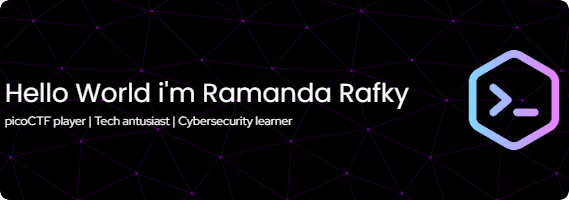

## Hello World, I'm Ramanda Rafky👋

<!-- - 🔭 I’m currently working on **Telkom University 0f Surabaya**
- 🌱 I’m currently learning [**picoCTF**](https://picoCTF.com)
- 😊😊😊

##### Skiles

###### Connect with me

###### My Github Stats

 -->

### Hello World, I'm Ramanda Rafky👋

##### 🌐 Socials:
  

##### 💻 Tech Stack:
  
##### 📊 GitHub Stats:
 
 

###### 🏆 GitHub Trophies

###### 🔝 Top Contributed Repo

---

<!-- Proudly created with GPRM ( https://gprm.itsvg.in ) -->
<h2 align="left">Play game with me</h2>

###

<picture>
  <source media="(prefers-color-scheme: dark)" srcset="https://raw.githubusercontent.com/ramandarafky/ramandarafky/output/pacman-contribution-graph-dark.svg">
  <source media="(prefers-color-scheme: light)" srcset="https://raw.githubusercontent.com/ramandarafky/ramandarafky/output/pacman-contribution-graph.svg">
  
</picture>

###